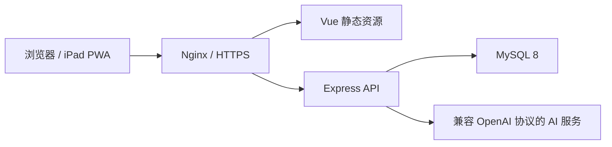

# 知练（ZhiLian Quiz）

知练是一个面向 iPad、个人学习和小规模多人使用场景的在线刷题平台。它把章节练习、随机抽题、错题复习、收藏、学习统计、题目纠错和 AI 讲解放在同一套轻量系统中，并支持 PWA 安装与 Apple Pencil 临时草稿。

> 本仓库只包含程序源码和少量完全虚构的示例题，不包含作者的私有题库、答案解析、Word/PDF 原稿、生产数据库或任何密钥。

## 主要能力

- 按科目、章节、题型和知识点筛选题目
- 支持单选题、多选题和判断题
- 完整章节进度续刷、答题卡和已答题目跳转
- 随机练习、错题重练和收藏练习
- 错题次数、连续答对掌握规则及个人学习统计
- 题目报错提交、管理员集中处理和题目在线校订
- AI 流式问答，支持 Markdown 与数学公式安全渲染
- AI 地址、模型、API Key 和系统提示词后台配置
- Apple Pencil 临时草稿板，关闭后不保存草稿内容
- 最多 5 个启用账号的轻量用户管理
- iPad/移动端响应式布局和 PWA 主屏幕安装

## 系统架构



| 模块 | 技术 |
| --- | --- |
| Web | Vue 3、TypeScript、Vite、Pinia、Vue Router、PWA |
| API | Express 5、TypeScript、Zod、mysql2 |
| 数据库 | MySQL 8 |
| 内容渲染 | marked、DOMPurify、KaTeX |
| 安全 | bcrypt、HttpOnly Cookie、Helmet、接口限流、AES-256-GCM |
| 部署 | Nginx、systemd、HTTPS，无需 Docker |

## 快速预览（无需 MySQL）

推荐使用 Node.js 24+ 和 pnpm 11+。

```bash
pnpm install
pnpm demo
```

打开 `http://localhost:5173`。演示模式使用 `data/questions.example.json` 中的虚构数据，操作只保存在内存或当前浏览器中；停止服务后会重置，也不会调用真实 AI 服务。

## 使用 MySQL 本地运行

### 1. 安装依赖

```bash
pnpm install
```

### 2. 创建数据库和专用账号

```sql
CREATE DATABASE shuati CHARACTER SET utf8mb4 COLLATE utf8mb4_0900_ai_ci;
CREATE USER 'quiz_user'@'127.0.0.1' IDENTIFIED BY '请替换为强密码';
GRANT ALL PRIVILEGES ON shuati.* TO 'quiz_user'@'127.0.0.1';
FLUSH PRIVILEGES;
```

如果当前 MySQL 不支持 `utf8mb4_0900_ai_ci`，可以改用 `utf8mb4_unicode_ci`。

### 3. 配置环境变量

```bash
cp .env.example .env
```

Windows PowerShell：

```powershell
Copy-Item .env.example .env
```

生成用于加密 AI Key 的 32 字节密钥：

```bash
node -e "console.log(require('node:crypto').randomBytes(32).toString('hex'))"
```

将生成的 64 位十六进制文本填入 `.env` 的 `APP_ENCRYPTION_KEY`，并修改数据库地址和初始管理员密码。

常用配置如下：

| 变量 | 默认值/用途 |
| --- | --- |
| `DATABASE_URL` | MySQL 连接地址，必须配置 |
| `QUESTION_DATA_PATH` | 题库 JSON 路径，默认 `data/questions.json` |
| `ADMIN_USERNAME` | 首次启动时创建的管理员账号 |
| `ADMIN_PASSWORD` | 首次启动管理员密码，生产环境必须修改 |
| `APP_ENCRYPTION_KEY` | 加密 AI API Key 的 64 位十六进制密钥 |
| `API_HOST` / `API_PORT` | API 监听地址和端口 |
| `SESSION_DAYS` | 登录会话有效天数 |
| `COOKIE_SECURE` | HTTPS 生产环境应设为 `true` |
| `TRUST_PROXY` | 位于 Nginx 后方时应设为 `true` |
| `MAINTENANCE_ENABLED` | 是否启用历史数据维护任务 |
| `PRACTICE_RETENTION_DAYS` | 已完成练习在活跃表中的保留天数，默认 180 |
| `AI_MESSAGE_RETENTION_DAYS` | AI 对话在活跃表中的保留天数，默认 180 |
| `MAINTENANCE_INTERVAL_HOURS` | 维护任务执行间隔，默认 24 小时 |
| `MAINTENANCE_BATCH_SIZE` | 单批归档数量，默认 500 |

### 4. 准备题库

```bash
cp data/questions.example.json data/questions.json
```

用自己的题目替换示例内容。字段格式可以直接参考 [`data/questions.example.json`](data/questions.example.json)。

`data/questions.json` 默认被 Git 忽略；也可以通过 `QUESTION_DATA_PATH` 指向仓库外的只读题库文件。不要提交真实题库、答案解析或原始资料。

### 5. 建表、导入并启动

```bash
pnpm db:schema
pnpm db:seed
pnpm dev
```

- Web：`http://localhost:5173`
- API：`http://127.0.0.1:3001`
- 健康检查：`http://127.0.0.1:3001/api/health`

重复执行 `pnpm db:schema` 是安全的。重复执行 `pnpm db:seed` 会根据稳定题目键更新题干、选项、答案和解析，不会清空用户、收藏、错题或答题历史。

## AI 快问

管理员可以在系统管理页配置兼容以下任一接口形式的 AI 服务：

- OpenAI Chat Completions
- OpenAI Responses

需要填写完整接口 URL、模型、API Key 和系统提示词。API Key 会使用 `APP_ENCRYPTION_KEY` 进行 AES-256-GCM 加密后存入 MySQL，浏览器不会收到明文。用户只有在提交当前题目的答案并看到解析后，才能针对该题询问 AI。

## 性能与缓存策略

系统针对小规模多人和单机部署做了轻量优化，不强制依赖 Redis：

| 数据 | 策略 | 主动失效时机 |
| --- | --- | --- |
| 登录鉴权 | 进程内缓存 60 秒 | 退出登录、管理员修改或停用用户 |
| 会话活跃时间 | 每个会话最多每 5 分钟写一次 | 自动节流 |
| 科目、章节、知识点目录 | 缓存 5 分钟，并合并并发加载 | 管理员修改题目 |
| 题目与选项静态数据 | 按题目缓存 10 分钟 | 管理员保存题目 |
| AI 配置 | 缓存 10 分钟 | 管理员更新配置 |
| 个人学习统计 | 缓存 60 秒 | 用户答题或修改收藏 |

API 会记录以下结构化性能日志，便于在 systemd 日志中定位热点：

- 执行超过 100ms 的 SQL
- 响应超过 500ms 的接口
- 单次请求执行 5 条及以上 SQL 的接口

生产环境可通过 `journalctl -u shuati` 查看。

## 180 天历史归档

维护任务默认每 24 小时运行一次：

1. 删除已经过期的登录会话。
2. 选取完成时间超过 180 天的练习。
3. 在事务中将练习及答题明细复制到归档表并核对数量。
4. 只有校验成功后才从活跃表删除原记录；失败则整批回滚。
5. AI 对话采用相同的“归档、校验、删除”流程。

未完成的练习不会被自动归档。累计答题统计、按题型统计、按章节统计、AI 提问权限和 AI 对话历史都会同时读取活跃表与归档表，因此归档不会让历史成绩消失。

维护任务使用 MySQL 命名锁避免多实例重复运行，每批默认最多处理 500 条、单次最多处理 20 批。归档表不设置级联外键，删除用户或题目时不会连带破坏已经归档的审计记录。

升级到包含归档功能的版本时，必须先执行：

```bash
pnpm db:schema
```

## 生产部署

推荐使用以下结构：

- systemd 运行 Node.js API
- Nginx 提供 `apps/web/dist` 静态文件
- Nginx 反向代理 `/api`
- Certbot 或其他方案提供 HTTPS
- MySQL 只监听可信网络，不向公网暴露

完整步骤和配置模板见 [`deploy/DEPLOY_NO_DOCKER.md`](deploy/DEPLOY_NO_DOCKER.md)。生产环境至少应设置：

```dotenv
COOKIE_SECURE=true
TRUST_PROXY=true
```

每次更新建议按以下顺序执行：

1. 备份应用目录和 MySQL 数据库。
2. 安装锁定版本的依赖并执行测试、构建。
3. 执行 `pnpm db:schema`。
4. 更新 API 和 Web 构建产物。
5. 重启 systemd 服务并检查健康接口及日志。

不要把 API 端口直接暴露到公网，也不要提交 `.env`、数据库备份、真实题库或生产密钥。

## 常用命令

| 命令 | 说明 |
| --- | --- |
| `pnpm demo` | 使用虚构数据预览，不连接 MySQL |
| `pnpm dev` | 同时启动 Web 和 API 开发服务 |
| `pnpm dev:web` | 只启动 Web |
| `pnpm dev:api` | 只启动 API |
| `pnpm typecheck` | 执行 TypeScript 和 Vue 类型检查 |
| `pnpm test` | 执行全部单元测试 |
| `pnpm build` | 生成 API 和 Web 生产构建 |
| `pnpm db:schema` | 创建或补充 MySQL 表结构 |
| `pnpm db:seed` | 导入或更新自备题库 |

## 项目结构

```text
apps/
  api/                    Express API、缓存、维护任务与测试
  web/                    Vue Web/PWA
database/
  schema.sql              MySQL 表结构及归档表
data/
  questions.example.json  虚构题库示例
deploy/
  nginx/                  Nginx 配置模板
  systemd/                systemd 服务模板
  env.production.example  生产环境变量模板
  DEPLOY_NO_DOCKER.md      完整生产部署说明
```

## 提交前检查

```bash
pnpm typecheck
pnpm test
pnpm build
```

当前测试覆盖答案判定、SQL 辅助值、AI 流式响应解析、缓存并发复用和归档日期计算。涉及数据库结构或查询行为的改动，还应在 MySQL 8 环境中执行一次最小端到端验证。

## 常见问题

### 启动时提示 `DATABASE_URL` 未配置

完整模式必须存在项目根目录 `.env`，并配置可访问的 MySQL 连接地址。如果只是查看界面，请使用 `pnpm demo`。

### 部署新版本后统计接口报归档表不存在

先执行 `pnpm db:schema` 创建归档表，再重启 API。

### PWA 仍显示旧页面

关闭所有已打开的页面后重新进入，或清除站点缓存并重新安装 PWA。发布时应确保 `index.html` 和新的静态资源同时更新。

### 接口返回 401

除登录和健康检查外，大部分接口都需要有效的 HttpOnly Session Cookie。请先登录，并确认反向代理没有丢弃 Cookie。

## 数据与安全说明

- `.env`、真实题库和数据库备份不应进入 Git。
- 生产数据库应使用专用低权限账号，不要让应用使用 MySQL `root`。
- 修改 `APP_ENCRYPTION_KEY` 会导致已有 AI API Key 无法解密，轮换前应先重新规划密钥迁移。
- 归档会从活跃表移除超过保留期的数据，生产启用前应建立可恢复的数据库备份。
- 导入第三方题库时，应确认数据来源、版权和使用授权。

## License

程序源码使用 [MIT License](LICENSE)。你导入的题库及相关资料仍归各自权利人所有。
